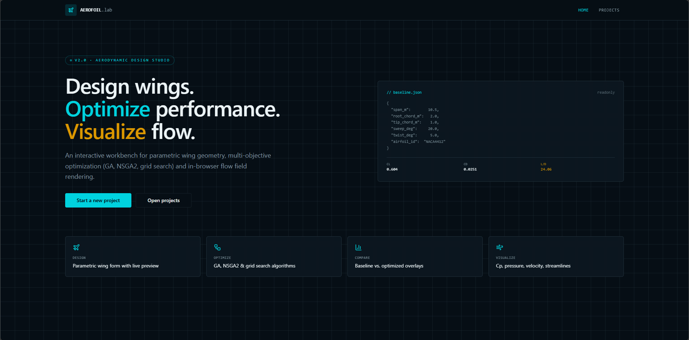
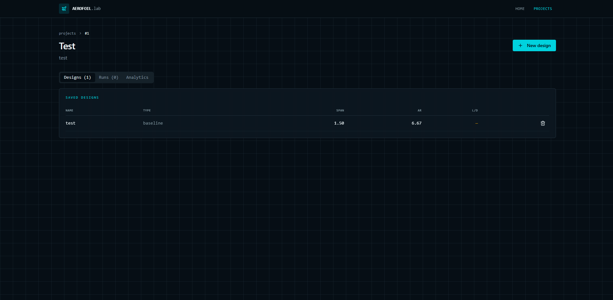
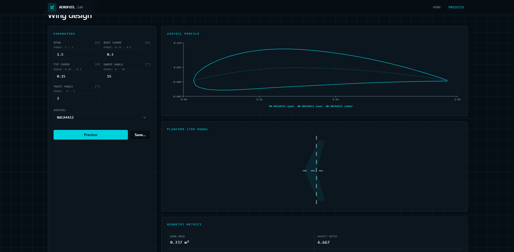
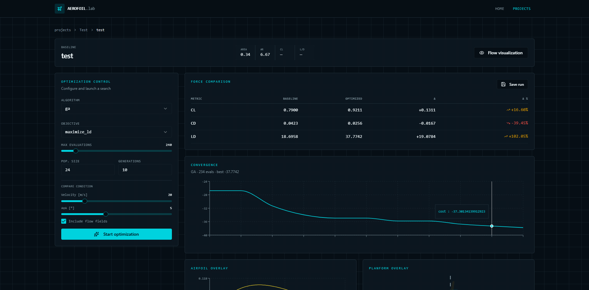
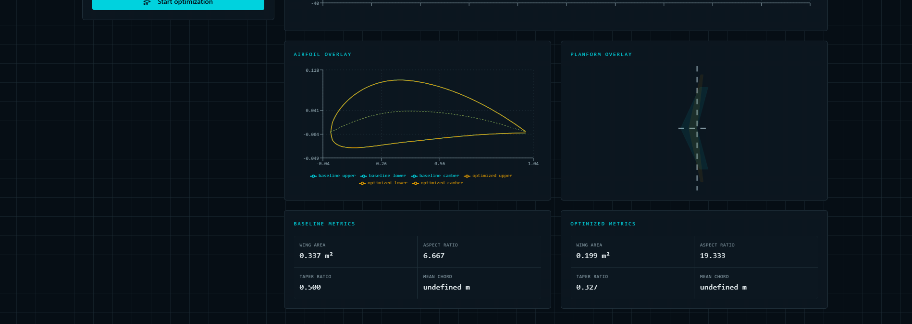
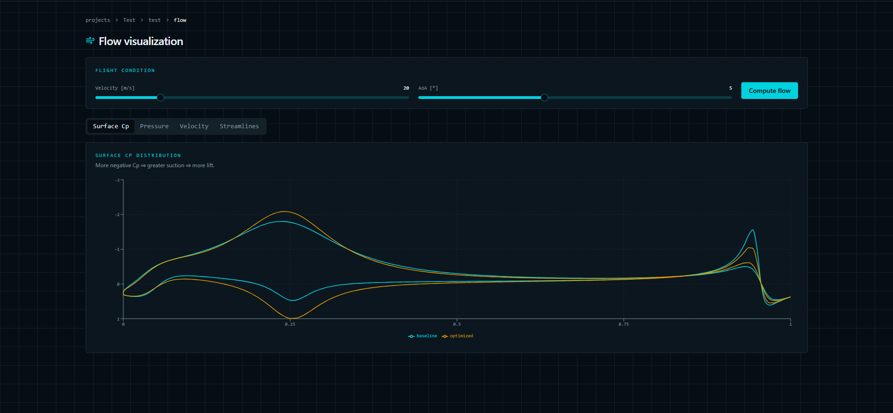
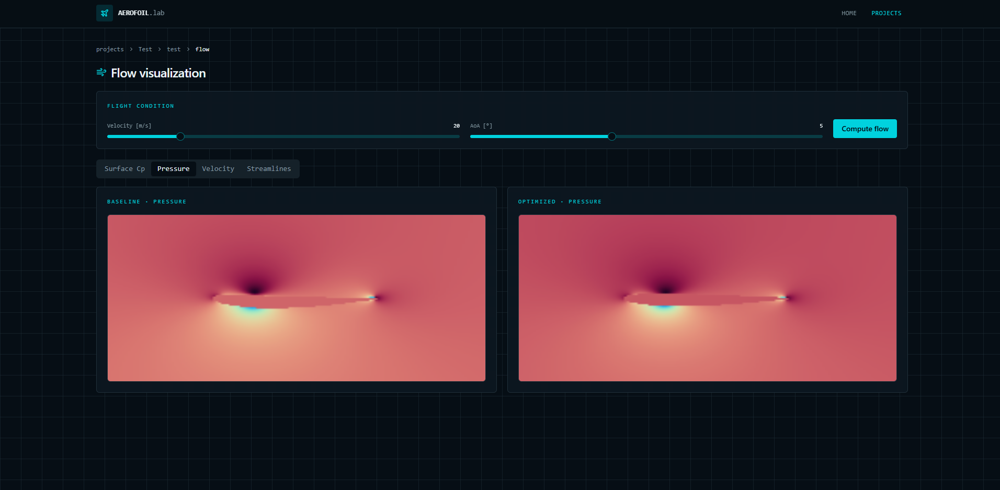
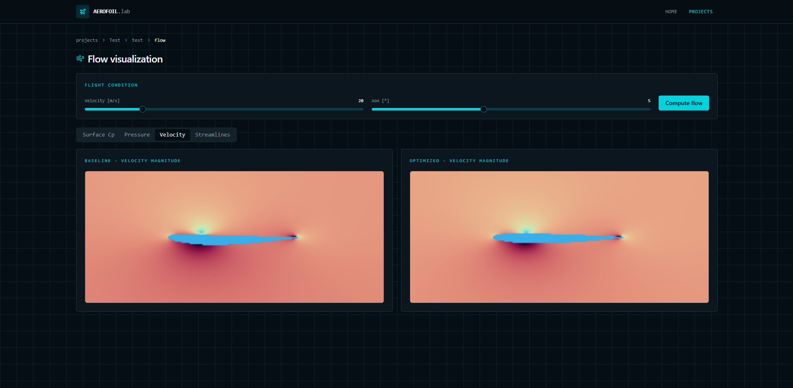
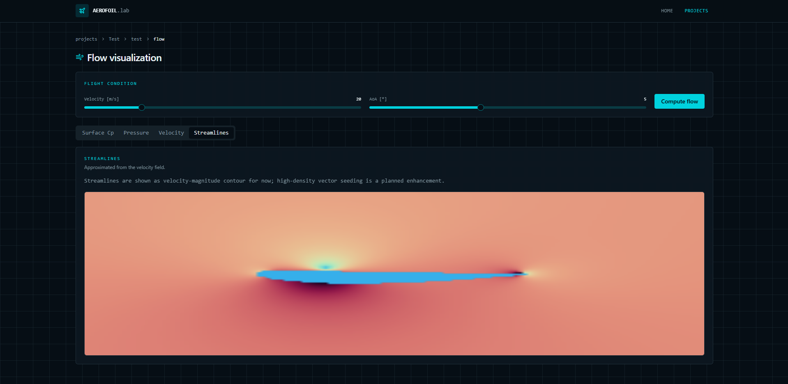

# Aerofoil.lab — AI-Assisted Wing CFD & Parametric Optimisation

A full-stack engineering application for designing, simulating, and optimising small UAV wings. The backend runs a physics-based aerodynamic solver with evolutionary optimisation algorithms; the frontend is an interactive React application for creating designs, launching optimisation jobs, and visualising results in real time.

---

## Screenshots

### Home — Aerodynamic Design Studio


### Projects — Design Library


### Wing Design — Parameter Form & Live Preview


### Optimisation — Force Comparison & Convergence


### Optimisation — Airfoil & Planform Overlays


### Flow Visualisation — Surface Cp Distribution


### Flow Visualisation — Pressure Contours


### Flow Visualisation — Velocity Magnitude


### Flow Visualisation — Streamlines


---

## Table of Contents

1. [Screenshots](#screenshots)
2. [Project Structure](#project-structure)
3. [Getting Started](#getting-started)
4. [Aerodynamics Primer](#aerodynamics-primer)
   - [Wing Geometry Parameters](#wing-geometry-parameters)
   - [Airfoil Profiles](#airfoil-profiles)
   - [Aerodynamic Coefficients](#aerodynamic-coefficients)
   - [Flight Conditions](#flight-conditions)
5. [Optimisation](#optimisation)
   - [Objectives](#objectives)
   - [Algorithms](#algorithms)
6. [Visualisation Guide](#visualisation-guide)
7. [Architecture](#architecture)
8. [Configuration Reference](#configuration-reference)
9. [API Reference](#api-reference)

---

## Project Structure

```
aerofoil-lab/
├── README.md
├── .gitignore
│
├── frontend/                      # React + TypeScript web application
│   ├── package.json
│   ├── vite.config.ts
│   ├── tsconfig.json
│   └── src/
│       ├── routes/                # File-based routing (TanStack Router)
│       │   ├── index.tsx          # Landing page
│       │   ├── projects.tsx       # Projects list
│       │   ├── projects.$projectId.tsx             # Project layout
│       │   ├── projects.$projectId.index.tsx       # Project overview
│       │   ├── projects.$projectId.design.tsx      # New design form
│       │   ├── projects.$projectId.designs.$designId.tsx        # Design layout
│       │   ├── projects.$projectId.designs.$designId.index.tsx  # Optimisation screen
│       │   └── projects.$projectId.designs.$designId.flow.tsx   # Flow visualisation
│       ├── components/
│       │   ├── wing/              # Domain-specific visualisation components
│       │   │   ├── airfoil-chart.tsx      # Airfoil cross-section overlay
│       │   │   ├── planform-chart.tsx     # Wing planform (top-down) overlay
│       │   │   ├── contour-canvas.tsx     # 2-D pressure / velocity heatmap
│       │   │   ├── metrics-panel.tsx      # Tabular aerodynamic metrics
│       │   │   ├── wing-param-form.tsx    # Design parameter input form
│       │   │   └── section.tsx            # Collapsible card wrapper
│       │   └── ui/                # shadcn/ui component library
│       └── lib/
│           ├── api.ts             # Typed HTTP client for the backend
│           └── utils.ts
│
└── backend/                       # Python scientific computing stack
    ├── requirements.txt
    ├── pyproject.toml
    ├── configs/
    │   ├── experiment.default.yaml   # Solver, sampling, optimisation defaults
    │   └── bounds.default.yaml       # Valid parameter ranges for wing design
    ├── src/
    │   ├── geometry/              # Wing and airfoil geometry generation
    │   ├── simulation/            # Aerodynamic solvers (analytic, panel2d)
    │   ├── optimization/          # GA, NSGA-II, grid-search optimisers
    │   ├── ml/                    # Surrogate model training and inference
    │   ├── visualization/         # Matplotlib / report generation
    │   ├── dataio/                # Data persistence and experiment tracking
    │   ├── cli/                   # Command-line interface
    │   └── web/                   # FastAPI application
    │       ├── api.py             # Route handlers
    │       ├── models.py          # SQLAlchemy ORM models
    │       └── db_service.py      # Database access layer
    └── tests/
        └── unit/                  # pytest unit tests
```

---

## Getting Started

### Backend

```bash
cd backend
python -m venv .venv
# Windows
.venv\Scripts\activate
# macOS / Linux
source .venv/bin/activate

pip install -r requirements.txt
uvicorn src.web.api:app --reload --host 0.0.0.0 --port 8000
```

The API will be available at `http://localhost:8000`. Interactive Swagger docs at `http://localhost:8000/docs`.

### Frontend

```bash
cd frontend
npm install          # or: bun install
npm run dev          # starts Vite dev server on http://localhost:3000
```

Set `VITE_API_BASE_URL=http://localhost:8000` in `frontend/.env` if the backend runs on a different host or port.

### Running Tests

```bash
cd backend
pytest
```

---

## Aerodynamics Primer

This section explains every parameter, coefficient, and concept used throughout the application. No prior aerodynamics knowledge is assumed.

---

### Wing Geometry Parameters

A wing is described by six parameters. All are exposed in the **New Design** form and returned by the API.

#### Span (`span_m`, metres)

The total distance from one wingtip to the other, measured straight across. A longer span generates more lift for the same speed but adds structural weight and drag at the tips.

```
   ←————————— span ——————————→
   |                          |
  tip                        tip
```

Typical UAV range in this tool: **1.0 – 2.0 m**.

#### Root Chord (`root_chord_m`, metres)

The chord is the straight-line distance from the leading edge (front) to the trailing edge (back) of the wing at a given spanwise position. The *root chord* is measured where the wing meets the fuselage — the widest point on a tapered wing.

```
  leading edge
  ●————————————————————● trailing edge
  ←—— root chord ——————→
```

Typical range: **0.15 – 0.50 m**.

#### Tip Chord (`tip_chord_m`, metres)

The chord measured at the wingtip. On a tapered wing, `tip_chord < root_chord`. A smaller tip chord reduces induced drag and moves the centre of pressure inward. The ratio `tip_chord / root_chord` is the *taper ratio*.

Constraint enforced by the tool: `tip_chord_m < root_chord_m`.
Typical range: **0.05 – 0.30 m**.

#### Aspect Ratio

Derived automatically from span and area:

```
AR = span² / wing_area
```

High AR (long, narrow wings) reduces induced drag and improves L/D but increases structural loads. Low AR (short, wide wings) is more structurally efficient but generates more induced drag. Displayed in the design card header.

#### Sweep Angle (`sweep_deg`, degrees)

The angle by which the wing's quarter-chord line is swept back from a line perpendicular to the fuselage. Positive sweep angles push the leading edge backward.

```
  No sweep (0°)          Swept back (20°)
  ___________              \___________
             |               \         |
```

- Positive sweep shifts the aerodynamic centre rearward, improving high-speed stability.
- Zero sweep maximises low-speed lift efficiency, preferred for slow UAVs.

Typical range: **0 – 30°**.

#### Geometric Twist (`twist_deg`, degrees)

The angle by which the tip airfoil section is rotated relative to the root, about the spanwise axis. Negative (wash-out) twist means the tip operates at a lower angle of attack than the root.

- **Wash-out (negative twist)**: reduces tip loading, delays tip stall, improves handling. Recommended for most UAVs.
- **Wash-in (positive twist)**: increases tip loading; rarely used in practice.

Typical range: **−5° – +5°**.

#### Airfoil ID (`airfoil_id`)

Identifies the 2-D cross-sectional profile applied uniformly across the full span. See [Airfoil Profiles](#airfoil-profiles) below.

---

### Airfoil Profiles

An airfoil is the 2-D cross-section of the wing — the shape you see if you cut the wing spanwise and look at the cut face. The airfoil defines how the wing generates lift and how much drag it produces.

#### Anatomy of an Airfoil

```
          upper surface (suction side)
         .·''''·.
       ·'    camber line    '·.
     ·'  ·····················  '·
   ●————————————————————————————●
   leading                       trailing
   edge         chord line        edge
       ·.                     .·'
         '·.               .·'
             '·..........·'
          lower surface (pressure side)
```

- **Chord line**: straight line from leading to trailing edge. The reference line for measuring AOA.
- **Camber line**: the curve midway between upper and lower surfaces. Its maximum perpendicular offset from the chord line is the *maximum camber*.
- **Thickness**: maximum distance between upper and lower surfaces, expressed as a percentage of chord length.
- **Leading-edge radius**: determines how rounded the very front of the airfoil is. A larger radius tolerates higher angles of attack before stalling; a sharper leading edge gives lower drag at design conditions.

#### NACA 4-Digit Series

All airfoils in this tool follow the NACA 4-digit naming convention, where the four digits encode the geometry directly:

```
NACA  M  P  XX
      │  │  │
      │  │  └── Maximum thickness as % of chord  (e.g. 12 → 12%)
      │  └───── Position of max camber in tenths of chord  (e.g. 4 → 40%)
      └──────── Maximum camber as % of chord  (e.g. 2 → 2%)
```

| Airfoil   | Camber | Camber position | Thickness | Character |
|-----------|--------|-----------------|-----------|-----------|
| NACA 0012 | 0 %    | —               | 12 %      | Perfectly symmetric. Equal lift in both directions. Standard reference and tail section profile. |
| NACA 2412 | 2 %    | 40 % chord      | 12 %      | Lightly cambered. Gentle, predictable stall. Good all-rounder for slow, stable UAVs. |
| NACA 4412 | 4 %    | 40 % chord      | 12 %      | More cambered. Higher maximum lift, higher drag. Suited to slow or heavily loaded aircraft. |

**How camber affects performance**: A positively cambered airfoil produces lift even at zero angle of attack. More camber raises CL_max (the ceiling before stall) but also raises drag and nose-down pitching moment. Symmetric airfoils (0 % camber) produce zero lift at zero AOA — useful for control surfaces and symmetric manoeuvres.

**How thickness affects performance**: Thicker airfoils have a more rounded leading edge, which delays stall and tolerates manufacturing imperfections better. Thinner profiles reduce drag at cruise speed but stall more abruptly and are harder to manufacture precisely.

---

### Aerodynamic Coefficients

Aerodynamic forces are expressed as dimensionless coefficients so that results scale independently of aircraft size, speed, and air density. The three key coefficients are displayed throughout the application.

#### Lift Coefficient (CL)

Quantifies how much lift the wing produces relative to the dynamic pressure and planform area:

```
CL = Lift [N] / (0.5 × ρ [kg/m³] × V² [m²/s²] × S [m²])
```

- `ρ` = air density (1.225 kg/m³ at sea level)
- `V` = airspeed (m/s)
- `S` = wing planform area (m²)

Typical values:
- **CL ≈ 0**: no net lift (symmetric airfoil at zero AOA, or stalled).
- **CL ≈ 0.3 – 0.8**: typical cruise for small fixed-wing UAVs.
- **CL ≈ 1.0 – 1.5**: high-lift configuration (slow speed, high AOA, or high-camber airfoil).
- **CL_max ≈ 1.2 – 1.8**: maximum before stall for NACA profiles at low Reynolds number.

CL increases almost linearly with angle of attack until the stall angle is reached.

#### Drag Coefficient (CD)

Quantifies total aerodynamic drag in the same normalised form:

```
CD = Drag [N] / (0.5 × ρ × V² × S)
```

Drag has two primary components:

- **Induced drag**: a by-product of lift generation. Proportional to CL². Reduced by high aspect ratio wings. Dominates at low speeds.
- **Parasitic drag** (form + skin friction): present even at zero lift. Reduced by thinner airfoils and smooth surfaces. Dominates at high speeds.

Total drag: `CD = CD_induced + CD_parasitic`

Typical values for small UAV cruise: **0.02 – 0.06**.

#### Lift-to-Drag Ratio (L/D)

The primary figure of merit for range and endurance:

```
L/D = CL / CD
```

L/D tells you how many units of lift are generated per unit of drag consumed. For a glider, L/D equals the glide ratio: an L/D of 15 means 15 metres of forward travel per metre of altitude lost.

- **L/D = 5 – 10**: poor efficiency, typical of stubby or drag-heavy designs.
- **L/D = 10 – 20**: good for small UAVs with fixed-pitch propulsion.
- **L/D = 20 – 40**: excellent; typical of sailplanes and high-AR designs.

Maximising L/D is the default optimisation objective because it directly maximises range and endurance for battery-powered UAVs.

#### Mean Values (Mission-Averaged)

The simulator evaluates each design across a sweep of velocities and angles of attack (the *mission profile* defined in `configs/experiment.default.yaml`). The application stores and displays **mean CL, mean CD, and mean L/D** — averages over that mission sweep. These appear in the design card header and in the design database.

---

### Flight Conditions

#### Angle of Attack (AOA, `aoa_deg`, degrees)

The angle between the chord line and the direction of the oncoming airflow.

```
  →→→→ free-stream airflow
                 ↑ AOA
     ___________/
    /
  leading edge
```

- **Positive AOA**: wing tilted nose-up. Increases lift coefficient linearly until stall.
- **Zero AOA**: chord line parallel to flow. Cambered airfoils still produce positive lift; symmetric ones produce zero.
- **Negative AOA**: nose-down. Reduces or reverses lift; useful for dive or pusher configurations.
- **Critical (stall) AOA**: typically 12 – 18° for NACA profiles at UAV Reynolds numbers. Beyond this, the upper-surface boundary layer detaches and lift collapses.

In the optimisation and flow screens, AOA is the angle at which the baseline and optimised designs are compared side by side.

#### Velocity (`velocity_mps`, m/s)

Free-stream airspeed. Small electric UAVs typically cruise at **10 – 30 m/s**. Higher speed increases dynamic pressure (`q = 0.5 × ρ × V²`), producing more lift and drag for the same CL/CD. The solver uses this to convert dimensionless coefficients into actual forces in Newtons.

#### Air Density (`air_density`, kg/m³)

Standard sea-level ISA value is **1.225 kg/m³**. Density decreases with altitude (~1.5 % per 100 m). The tool uses 1.225 kg/m³ throughout unless overridden in the config.

---

## Optimisation

### Objectives

The optimiser searches the six-dimensional parameter space to minimise a scalar cost derived from the chosen objective:

| Objective      | Cost function | When to use |
|----------------|---------------|-------------|
| `maximize_ld`  | `−(L/D)`      | **Default.** Maximises range and endurance. Best general-purpose objective for UAVs. |
| `maximize_cl`  | `−CL`         | When maximum lift capacity is the goal, e.g. carrying a heavy payload at low speed. |
| `minimize_cd`  | `CD`          | When minimum drag matters most, e.g. high-speed dash or record-range flight at fixed lift. |

### Algorithms

#### Grid Search

Evaluates all combinations of parameter values on a regular grid. With `grid_points_per_dim = N` across 6 parameters, the cost is `N^6` solver calls. Useful for quick 2-point or 3-point scans; impractical beyond `N = 4`.

#### Genetic Algorithm (GA)

Evolutionary search inspired by natural selection:

1. **Initialise** a random population of `population_size` wing designs.
2. **Evaluate** each with the aerodynamic solver.
3. **Select** the fittest individuals (those with the best objective score).
4. **Crossover**: combine two parents' parameters to produce offspring.
5. **Mutate**: randomly perturb individual parameters with probability `mutation_rate`.
6. **Replace** the old generation and repeat for `generations` cycles.

The GA efficiently handles the non-convex, discontinuous search space (airfoil choice is discrete; geometry is continuous). It is the **recommended algorithm** for most optimisation runs.

#### NSGA-II (Non-dominated Sorting GA II)

A multi-objective variant of the GA. Instead of a single objective, NSGA-II simultaneously maximises CL and minimises CD, producing a *Pareto front* — the set of designs where no other design is strictly better at both objectives at once.

The Pareto front lets you inspect the trade-off between lift and drag and pick the design that matches your mission priority. It is visualised as a CL–CD scatter on the results screen.

---

## Visualisation Guide

### Optimisation Screen

#### Force Comparison Table

After optimisation completes, a table compares aerodynamic metrics between baseline and optimised designs at the selected flight condition:

| Column | Meaning |
|--------|---------|
| Baseline | Metric value for the design you submitted |
| Optimised | Metric value for the best design found by the solver |
| Δ | Absolute change: optimised − baseline |
| Δ % | Relative change as a percentage |

Green (↑) means the metric improved toward the objective. Red (↓) means it moved in the wrong direction — common for secondary metrics when optimising a single objective (e.g. CD may rise slightly if the objective is `maximize_cl`).

#### Convergence Chart

A line chart of the optimiser's *best cost* (y-axis) against cumulative evaluations (x-axis). Cost decreases (improves) as better designs are found.

- **Steep early drop → plateau**: normal. Most improvement happens in the first 20–30 % of evaluations.
- **Flat from the start**: the initial population already found near-optimal designs, or the search space is too tightly constrained by parameter bounds.
- **Still falling at the budget limit**: the run was cut short; increasing `max_evaluations` would help.

#### Airfoil Overlay

Both cross-sections (baseline in teal, optimised in amber) drawn to scale on shared axes, auto-scaled to fit whichever is larger so neither is clipped. Reveals:

- **Camber changes**: the upper surface arches higher on a more-cambered airfoil.
- **Thickness changes**: a thicker or thinner profile across the chord.
- **Chord-length changes**: if the optimiser reduced root/tip chord to lower drag, the optimised outline is physically smaller.

#### Planform Overlay

Top-down view of the wing outline (leading and trailing edges) for both designs. Span runs left-to-right; chord depth runs top-to-bottom. Reveals:

- **Span changes**: wider or narrower wing.
- **Taper changes**: ratio between tip and root chord.
- **Sweep changes**: angle of the leading edge relative to the fuselage axis.

---

### Flow Visualisation Screen

Click **Flow visualisation** after an optimisation run that had **Include flow fields** enabled. The screen computes a dedicated flow solve at your chosen velocity and AOA — independent of the optimisation run.

#### Surface Cp Chart

Coefficient of pressure (Cp) along the normalised chord position (0 at leading edge → 1 at trailing edge). Two lines: baseline (teal) and optimised (amber).

```
Cp
 0.0  ————————————————————  ← stagnation point (Cp ≈ +1 at leading edge)
 
-0.5      (upper surface — suction)
     
-1.0
     ↑ more negative Cp = stronger suction = more lift
-1.5

      0.0       x/c       1.0
```

Key things to read:

- **Area between upper and lower curves**: proportional to CL. A larger enclosed area means more lift.
- **Suction peak magnitude** (most negative Cp near the leading edge): stronger peak = more lift but also closer to separation.
- **Pressure recovery slope** (Cp rising from peak back toward 0 over the rear half of the chord): too steep = boundary-layer separation = drag rise and potential stall.

#### Pressure Contour (2-D field)

False-colour heatmap of static pressure around the airfoil. Blue = low pressure (upper surface suction side); red/yellow = high pressure (lower surface and leading-edge stagnation region). The pressure difference across the airfoil is what generates lift.

#### Velocity Magnitude Contour

False-colour heatmap of flow speed (m/s). The flow accelerates over the upper surface (higher speed → lower pressure, per Bernoulli's principle) and decelerates slightly below. The slow-moving region just behind the trailing edge is the *wake*; a thicker or more turbulent wake means higher drag.

#### Streamlines

Paths followed by fluid particles as they travel around the airfoil, computed from the velocity field. Streamlines that hug the surface closely indicate attached, efficient flow. Streamlines that break away from the upper surface indicate stall or near-stall conditions.

---

## Architecture

```
Browser  (React 19 + TanStack Router + Recharts)
    │
    │  JSON over HTTP  (default: http://localhost:8000)
    ▼
FastAPI  (backend/src/web/api.py)
    │
    ├─ POST /api/wings/preview       → geometry + quick simulation
    ├─ POST /api/workflows/optimize  → full optimisation loop + flow fields
    ├─ GET  /api/config/defaults     → parameter bounds and algorithm options
    └─ REST /api/projects/**         → design persistence (SQLite / SQLAlchemy)
    │
    ├── backend/src/geometry/        → NACA airfoil generation, wing geometry
    ├── backend/src/simulation/      → Panel2D solver, analytic fallback
    ├── backend/src/optimization/    → GA, NSGA-II, grid search
    └── backend/src/visualization/   → comparison report builder
```

The frontend is a pure renderer — it does no aerodynamic computation and holds no domain state beyond UI form values. All physics runs in the backend, and the frontend renders whatever JSON the API returns.

### Solver — Panel2D

The default solver is a 2-D discrete-vortex **panel method**:

1. Discretise the airfoil surface into `n_panels` straight-line segments.
2. Place a vortex singularity on each panel.
3. Solve the linear system that enforces zero normal-flow through every panel.
4. Recover surface pressure (Cp) from the vortex strengths via Bernoulli.
5. Integrate Cp over the surface to get sectional CL and CD.
6. Optionally compute a velocity and pressure field on a `grid_nx × grid_ny` Cartesian mesh.

An analytic fallback (thin-airfoil theory) is used if panel2d is unavailable (`allow_fallback: true`).

### Database

SQLite database at `backend/wing_design.db` (created automatically on first run). Three tables:

| Table | Purpose |
|-------|---------|
| `projects` | Named containers grouping related designs and runs |
| `designs` | Wing parameter sets with stored aerodynamic metrics |
| `optimization_runs` | Optimisation job records: settings, convergence history, results |

---

## Configuration Reference

`backend/configs/experiment.default.yaml` — full annotated listing:

```yaml
conditions:
  air_density: 1.225          # kg/m³  (ISA sea-level standard)
  velocities_mps: [15, 20, 25]  # Mission velocity sweep (m/s)
  aoa_deg_start: -5           # First angle of attack in sweep (degrees)
  aoa_deg_stop: 15            # Last angle of attack in sweep (degrees)
  aoa_deg_step: 5             # Step size (degrees)

solver:
  name: panel2d               # 'panel2d' (default) or 'analytic'
  allow_fallback: true        # Use analytic solver if panel2d fails
  save_fields: true           # Persist pressure/velocity field files
  panel2d:
    n_panels: 160             # Surface panel count — more = more accurate, slower
    grid_nx: 140              # Flow-field Cartesian grid columns
    grid_ny: 110              # Flow-field Cartesian grid rows

optimization:
  algorithm: ga               # 'grid', 'ga', or 'nsga2'
  objective: maximize_ld      # 'maximize_ld', 'maximize_cl', 'minimize_cd'
  max_evaluations: 1000       # Total solver-call budget
  ga:
    population_size: 40       # Designs per generation
    generations: 30           # Evolution cycles
    crossover_rate: 0.9       # Probability of crossover per parent pair
    mutation_rate: 0.2        # Probability of mutating each parameter
  nsga2:
    population_size: 40
    generations: 30
    crossover_rate: 0.9
    mutation_rate: 0.2
  grid:
    points_per_dim: 4         # Grid points per dimension (total = 4^6 = 4096)
```

`backend/configs/bounds.default.yaml` — the valid ranges the optimiser searches and the validation rules enforced when saving a design manually.

---

## API Reference

Full interactive documentation at `http://localhost:8000/docs` (Swagger UI) when the backend is running.

| Method | Path | Description |
|--------|------|-------------|
| GET | `/api/health` | Liveness check |
| GET | `/api/config/defaults` | Parameter bounds, airfoil list, algorithm options |
| POST | `/api/wings/preview` | Generate geometry and compute quick metrics for a parameter set |
| POST | `/api/workflows/optimize` | Full optimisation — returns baseline, optimised, comparison table, convergence data, and optional 2-D flow fields |
| GET | `/api/projects` | List all projects |
| POST | `/api/projects` | Create a project |
| GET | `/api/projects/{id}` | Get a single project |
| GET | `/api/projects/{id}/designs` | List designs in a project |
| POST | `/api/projects/{id}/designs` | Save a design |
| GET | `/api/designs/{id}` | Fetch a single design by ID |
| DELETE | `/api/designs/{id}` | Delete a design |
| GET | `/api/projects/{id}/optimization-runs` | List saved optimisation runs |
| POST | `/api/projects/{id}/optimization-runs` | Save an optimisation run record |
